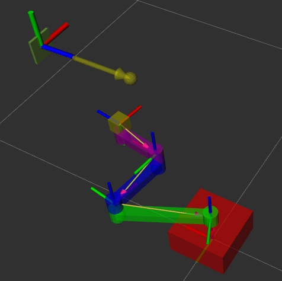

## About


This project uses visual servo-ing to control a simple 3-DOF planer arm to align with target pose determine
by position of an AR-tag.  The arm and camera are simulated in gazebo (ignition) using a ros2 control to
perform velocity control of individual joints.

While moving arm end-effector toward the AR target,
the camera heading it also moved to it points at center of AR-tag so the tag doesn't go out of the camera view.

The control process also subscribes to a twist command that allows manual control of arm end-effector positions.

## Implmenation Details

### Direct Gazebo Communication
Gazebo uses protobuf as a communcation transport which is differnt than ROS2.
Instead of use a gazebo-to-ros bridge for, the camera image, camera info, and clock topics
are used directly from gazebo inside the ROS2 node.  Mutexes are used to prevent race conditions.

### Ceres
Ceres auto-differentiation (ceres::Jet) are uses to computer the Jacobian from the end-effector postion and angle, to the individual joint angles.

### CV Mat Image
Instead of copying image data from gazebo input to a cv::Mat, the data is "borrowed" instead.

### AR Tag Frame
```
 ^ y
 |
 |
 +-----> x
 z (facing out)
```

### Singularities
There is explicit code to avoid arm singularities.  However, if joint velocities would exceed limits to achieve target end-effector velocities, all joint velocites are scaled back.   This means the arm will rougly move in teh intended direction when operating near singularities.

### Orientation
The detected AR-tag orientation is jumpy.  This is probably because of the low-resolution camera.
Filtering orientation would probably help reduce effects on visual servo-ing.

## Usage

### Install
For ROS Iron need to run Gazebo Fortress
```
apt update
apt install ros-iron-gz-ros2-control ros-iron-ros2-control ros-iron-ros2-controllers
```

### Build
```
colcon build --packages-select gz_arm --cmake-args -DCMAKE_BUILD_TYPE=RelWithDebInfo
```

### Run

This runs gazebo simulator, load controllers, and moves arm
to a better initial position where joint angles aren't all zero.
```
ros2 launch gz_arm gz_sim_launch.py
```

This runs Aruco detector and arm control node that will perform visual servoing
```
ros2 launch gz_arm gz_arm_launch.py
```

The code will output debugging visualization including detected AR pose, and end-effector target position.
```
rviz2 -d resources/gz_arm.rviz
```



This can be used to manual control arm end-effector position.  Pressing a key will send a twise command
that will be followed for half a second.   You must keep sending motion commands to prevent visual servoing
to take back control of arm.
```
ros2 run teleop_twist_keyboard teleop_twist_keyboard
```

## TODO

- [ ] unified sim + control top-level launch
- [ ] non-hardcoded path to gz-control plugin library
- [ ] live test-case of visual servoing
- [ ] filter on quaternion orientation